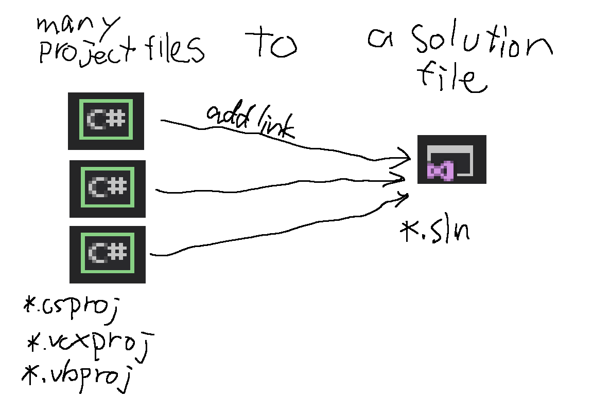

# projects2sln
---------------------
---------------------

## Overview
-----
Automate generating a solution file(*.sln) binds project files(*.csproj,*.vbproj,*.vcxproj).  

Work like this.

## How to use
-----
1. Install these software.
	* VisualStudio
	* Powershell
1. download p2j.ps1 from here.
1. Execute p2j.ps1 in Powershell like this `PS > p2j.ps1 <PathToRootOfProjects>`
	* This software searches project file recurse from <PathToRootOfProjects>.
1. You can find "Solution.sln" current directory.
	
## LICENSE
-----
### WTFPL  
            DO WHAT THE FUCK YOU WANT TO PUBLIC LICENSE
                    Version 2, December 2004

 Copyright (C) 2004 Sam Hocevar <sam@hocevar.net>

 Everyone is permitted to copy and distribute verbatim or modified
 copies of this license document, and changing it is allowed as long
 as the name is changed.

            DO WHAT THE FUCK YOU WANT TO PUBLIC LICENSE
   TERMS AND CONDITIONS FOR COPYING, DISTRIBUTION AND MODIFICATION

  0. You just DO WHAT THE FUCK YOU WANT TO.